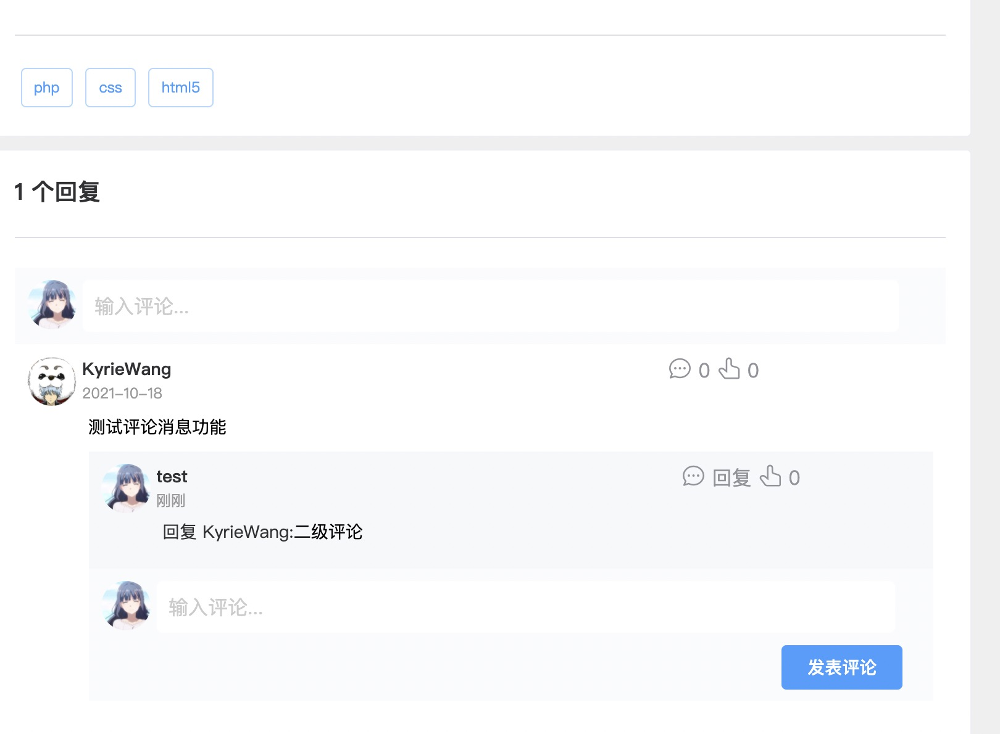
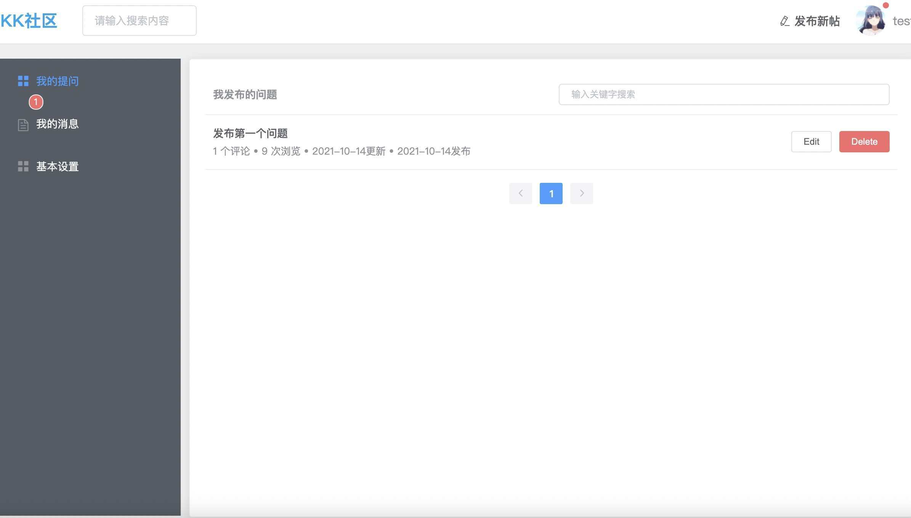
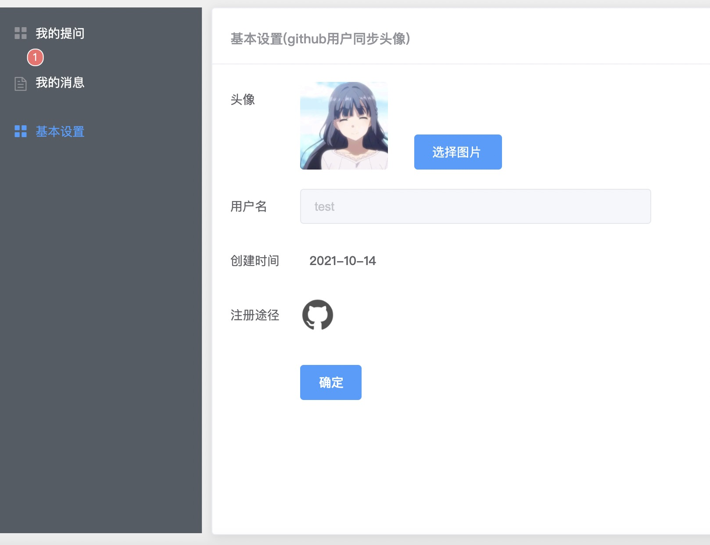

## 基于SpringBoot的论坛网站
线上地址：www.kyriewang.cn 

## 技术栈
|  技术   |  链接   |
| --- | --- |
|  Spring Boot   |  http://projects.spring.io/spring-boot/#quick-start   |
|   MyBatis  |  https://mybatis.org/mybatis-3/zh/index.html   |
|   MyBatis Generator  |  http://mybatis.org/generator/   |
|   Mysql  |     |
|   Flyway  |   https://flywaydb.org/getstarted/firststeps/maven  |
|Lombok| https://www.projectlombok.org |
|Github OAuth|https://developer.github.com/apps/building-oauth-apps/creating-an-oauth-app/|
|QCloud-cos|https://cloud.tencent.com/document/product/436/10199|
|Element-ui|https://element.eleme.cn/#/zh-CN/|
|Redis|
|Shiro+JWT|
### 前端地址
https://github.com/KyrieWang233/kkbbs-vue

### 需要的操作和配置
运行 migrate 和 generator 的命令
```bash
mvn flyway:migrate
mvn -Dmybatis.generator.overwrite=true mybatis-generator:generate
```

需要自己添加的配置文件 `user.properties` 内容如下： 
```properties
github.client.id=
github.client.secret=
github.redirect.url=
qcloud.secretId=
qcloud.secretKey=
kyriewang.jwt.secret=
# token有效时长
kyriewang.jwt.expire=604800
kyriewang.jwt.header=token
```
主要是个人学习所用，代码很多地方不规范

数据库方面只是简单了使用了MyBatis Generator,处于偷懒和注解配置一起混用了

### 几个简单的页面展示
1. 首页
   
2. 评论
   
3. 个人页面
   
4. 更换头像
   